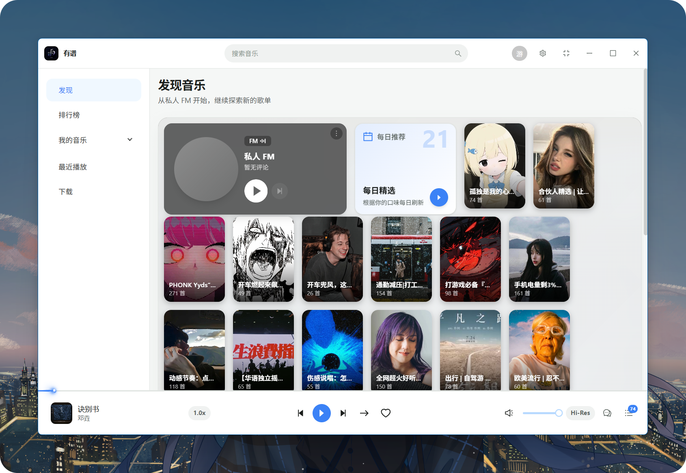
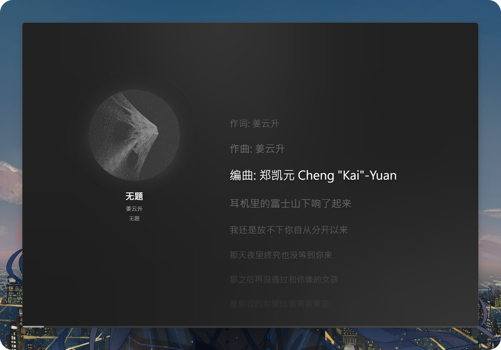

# 有谱 Youpu

[](LICENSE)
[](https://github.com/DouDouLi-YouTang/Youpu/releases)
[](https://github.com/DouDouLi-YouTang/Youpu/actions/workflows/ci.yml)
[](https://github.com/DouDouLi-YouTang/Youpu/stargazers)

一个简洁好看的网易云音乐桌面客户端，免费、开源。

> 在电脑上，把听歌这件事做得更舒服一点。

## 它能做什么

- 🎵 **听歌**：搜索、播放、歌单、排行榜、每日推荐、私人 FM、心动模式
- 📝 **歌词**：沉浸式歌词面板，支持逐字卡拉OK、翻译、罗马音
- 📂 **歌单**：创建、收藏、管理自己的歌单
- 🎨 **好看**：多套主题色、封面取色、流畅的过渡动画
- 🖥️ **桌面体验**：迷你模式、系统托盘、倍速播放、多档音质
- 🔄 **自动更新**：内置更新器，正式版 / Beta 版双通道

## 截图

### 主页



### 歌词面板



## Star History

[](https://star-history.com/#DouDouLi-YouTang/Youpu&Date)

## 下载安装

前往 [Releases](https://github.com/DouDouLi-YouTang/Youpu/releases) 下载最新版本：

| 文件 | 说明 |
| --- | --- |
| `youpu-x.y.z-setup.exe` | 正式版安装包（NSIS） |
| `youpu-x.y.z-beta.n-setup.exe` | Beta 预发布安装包 |

- 正式版：稳定功能，推荐大多数用户
- Beta 版：更早体验新功能，可能不稳定

安装后应用会通过 GitHub Releases 自动检查更新（设置 -> 应用更新 可切换通道或关闭）。

### 安装界面

安装包用的是自定义界面（不是 NSIS 默认的五步向导）：一个无边框窗口里用 WebView2 渲染
品牌动画、核心功能展示与安装选项，点「开始安装」后原地切换到进度与完成态，全程单窗口。

- 实现与排障见 [`tools/setup-host/README.md`](tools/setup-host/README.md)
- 机器上没有 WebView2 运行时时会自动回退到系统原生向导，安装不会失败

## 低内存模式

桌面音乐播放器大部分时间挂在托盘里，而 Chromium 的渲染进程常驻 200–400MB ——
最小化并不会释放它。低内存模式会在窗口最小化/隐藏到托盘后把渲染进程整个销毁，
再次唤起时重建。音频始终由主进程里一个隐藏的播放引擎输出，渲染层只负责发控制命令，
所以回收渲染进程不会打断音乐。

设置 -> 低内存模式 是一个开关（默认开启）：

| 模式 | 行为 |
| --- | --- |
| 开启（默认） | 最小化/隐藏到托盘后延迟 8 秒回收渲染进程；回收期间音乐继续播放 |
| 关闭 | 不回收渲染进程 |

迷你模式与置顶窗口不回收。回收时正在播放的话，播完会按原来的队列 / 私人 FM /
心动模式自动续上下一首；再次唤起窗口时重建渲染进程，向引擎取回队列、当前曲目、
进度、音量与倍速，正在播就继续显示在播，不用重新点播放。

实现要点：回收前主进程会抓一份播放队列与播放状态快照，既用于渲染层不在期间的
降级播放，也作为重建后的恢复载荷；重建后由
`src/features/player/use-low-memory-restore.ts` 连上引擎并对齐界面（不会重新加载音频）。
开关状态存在 `userData/low-memory.json`；回收延迟可用环境变量
`YOUPU_LOW_MEMORY_DELAY_MS` 覆盖（调试/自动化用）。旧版的「仅在未播放时回收 /
一直回收」统一迁移为开启。

## 版本与更新通道

版本号遵循 [SemVer](https://semver.org/)：

- `v2.0.5` -- 正式版
- `v2.0.5-beta.1` -- Beta 预发布版

应用内更新通道对应关系：

| 应用内通道 | 接收的版本 | GitHub Release |
| --- | --- | --- |
| 正式版（默认） | 仅 `x.y.z` | 普通 Release |
| Beta 版 | `x.y.z` 与 `x.y.z-beta.n` | 标记 Pre-release |

从 Beta 切回正式版：设置中将通道切为「正式版」，下一个更高版本号正式版发布后自动回到正式通道。

## 从源码运行

需要先装好 [Node.js](https://nodejs.org/)（20 或更高版本）。

```bash
# 1. 克隆仓库
git clone https://github.com/DouDouLi-YouTang/Youpu.git
cd Youpu

# 2. 安装依赖
npm install

# 3. 启动
npm run dev
```

如果 Electron 下载不动，可以先用国内镜像：

```powershell
$env:ELECTRON_MIRROR = 'https://npmmirror.com/mirrors/electron/'
node node_modules/electron/install.js
```

## 打包

```bash
npm run build
```

一条命令完成：类型检查 → 编译渲染层/主进程 → 打包内嵌后端 → 编译安装界面宿主 → 生成安装包。
产物输出到 `dist/<版本号>/`：

| 文件 | 说明 |
| --- | --- |
| `youpu-x.y.z-setup.exe` | NSIS 安装包（自定义安装界面） |
| `youpu-x.y.z-portable.zip` | 便携版 |
| `latest.yml` / `beta.yml` | 自动更新元数据（正式版 `latest.yml`，Beta 版 `beta.yml`） |

带 `--publish never`，只产出本地文件、不会发布到 GitHub Releases。发布走下面的
「发布新版本」（推 tag 后由 CI 打包并上传）。

## 本地更新测试（不发线上）

改自动更新/安装流程时，先在本地验证，不要每次发到 GitHub Releases。

```bash
# 1. 本地构建安装包（只产出 dist/<版本>/，不发布）
npm run build

# 2. 起本地更新源（默认托管 dist/<当前版本>/，端口 8080）
npm run serve:updates
```

然后启动已安装的打包应用，让它指向本地源：

```bash
# Windows（cmd）
set YOUPU_UPDATE_FEED_URL=http://127.0.0.1:8080 && "%LOCALAPPDATA%\Programs\youpu\Youpu.exe"

# Windows（PowerShell）
$env:YOUPU_UPDATE_FEED_URL="http://127.0.0.1:8080"; & "$env:LOCALAPPDATA\Programs\youpu\Youpu.exe"
```

原理：`electron/main/updater.ts` 的 `applyChannel` 检测到环境变量 `YOUPU_UPDATE_FEED_URL` 时，
改用 generic provider 从本地服务器拉 `<通道>.yml`（`beta.yml`/`latest.yml`），
安装包按 yml 里的相对路径从本地下载。

完整验证一条链：

1. 把旧版本装到机器上（包含本地源切换代码的那版）；
2. 改版本号 → `npm run build` 构建新版本；
3. `npm run serve:updates` 起服务；
4. 带 `YOUPU_UPDATE_FEED_URL` 启动旧版 → 检查更新 → 下载 → 更新并重启；
5. 验证无误后再走「发布新版本」发线上。
## 发布新版本（维护者）

### 方式一：一键脚本（推荐）

双击仓库根目录的 `publish-release.bat`，按提示选择「正式版 / Beta 版」并输入版本号即可。脚本会自动完成：切到 main → 同步 → 更新版本号 → 提交 → 打 tag → 推送。

### 方式二：手动命令

```bash
# 正式版
npm version 2.0.5
git push github main
git push github v2.0.5

# Beta 版（版本号必须带 -beta.n 后缀，才会被标记为 Pre-release）
npm version 2.0.5-beta.1
git push github main
git push github v2.0.5-beta.1
```

> 注意：推送目标是 `github` 远程（GitHub 仓库），不是 `origin`（指向 gitee）。

推送 `v*` tag 后 GitHub Actions 自动打包并发布到 Releases：正式版为普通 Release（Latest），Beta 版自动标记为 Pre-release。

## 说明

- 音乐数据来自网易云音乐，本项目仅供学习交流使用
- 使用前请遵守相关服务条款

## License

[MIT](LICENSE)
